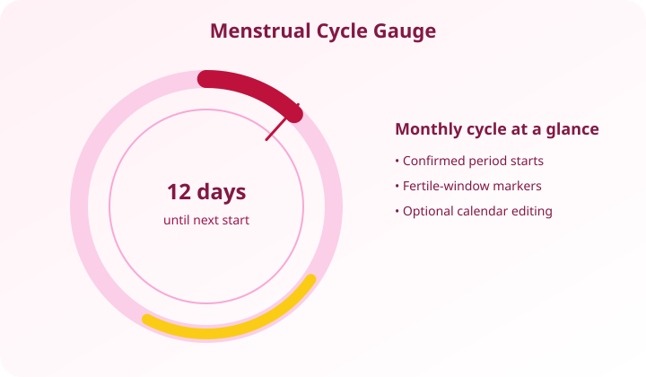
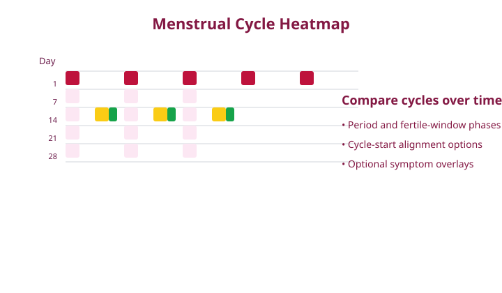

# Menstrual Cycle Companion Cards

Optional Lovelace cards for the [Menstrual Cycle Companion](https://github.com/Lyttle-Development/menstrual-cycle-companion) Home Assistant integration.





## Included cards

- `custom:menstrual-cycle-gauge-card` — monthly circular phase view with optional calendar editing.
- `custom:menstrual-cycle-heatmap-card` — historical cycle comparison with period and fertile-window markers.

The cards do not store cycle data and cannot work without a configured integration sensor.
The HACS gauge resource also loads and registers the heatmap card, so both card
types are available even when HACS exposes only the primary gauge resource.

The gauge's colored outer ring shows the proposed menstruation, follicular,
ovulation, and luteal phases. The calendar editor uses matching colored
underlines for each proposed phase, while confirmed bleeding days remain filled.

## Install with HACS

1. Install and configure **Menstrual Cycle Companion** first.
2. Open **HACS → Frontend**.
3. Search for **Menstrual Cycle Companion Cards** and install it.
4. Restart Home Assistant if HACS requests it.
5. If the resources are not added automatically, go to **Settings → Dashboards → Resources** and add:

   - `/hacsfiles/menstrual-cycle-companion-cards/menstrual-cycle-gauge-card.js` as **JavaScript module**
   - `/hacsfiles/menstrual-cycle-companion-cards/menstrual-cycle-heatmap-card.js` as **JavaScript module**

For an unpublished repository, add this repository to HACS as a custom **Dashboard** repository.

## Gauge card example

```yaml
type: custom:menstrual-cycle-gauge-card
entity: sensor.anna
friendly_name: Anna
title: Cycle gauge
view_mode: gauge
show_fertile_period: true
calendar_edit_enabled: true
calendar_selection_mode: range
theme_mode: auto
```

Use the top tabs to switch between **Gauge**, **Calendar**, and **Details**. In
the **Calendar** tab, the default `range` mode lets you click the first day and
then the last day of the cycle.
The interval is highlighted while it is being selected and the completed range
is shown with rounded start/end caps. Set `calendar_selection_mode: toggle` to
use the original single-day add/remove behavior. The calendar can be navigated
backward or forward without a date limit; use **Today** to return to the
current month.
Set `view_mode: calendar` or `view_mode: details` to open directly on those
views; the in-card tabs let you switch between all three at any time.

## Heatmap example

```yaml
type: custom:menstrual-cycle-heatmap-card
entity: sensor.anna
title: Cycle history
show_fertile_period: true
cycle_alignment: bottom
```

`cycle_alignment` can be `top` (align from cycle start) or `bottom` (align from cycle end).
The heatmap includes all supplied historical and predicted cycles by default.
The gauge card extends the forecast on demand as you navigate forward, so its
month navigation has no forecast horizon. Period duration is learned
automatically by the integration.

## Symptom overlays

The heatmap can display optional date-list attributes from other sensors:

```yaml
symptom_entities:
  - entity: sensor.anna_pms_notes
    name: Symptoms
    icon: mdi:note-heart-outline
```

The referenced sensor should expose a `dates`, `date_list`, or `history` attribute containing ISO dates (`YYYY-MM-DD`).

## Manual installation

Copy both JavaScript files into `/config/www/`, add them as JavaScript-module resources, and clear the browser cache. The integration must still be installed separately.

## Publishing

To publish a HACS-detectable release, update `version.json` (`major`, `minor`, or
`patch`) and push the change to `main`. The publishing workflow creates a matching
`v<major>.<minor>.<patch>` GitHub release.

## License

MIT. See [`LICENSE`](LICENSE).
